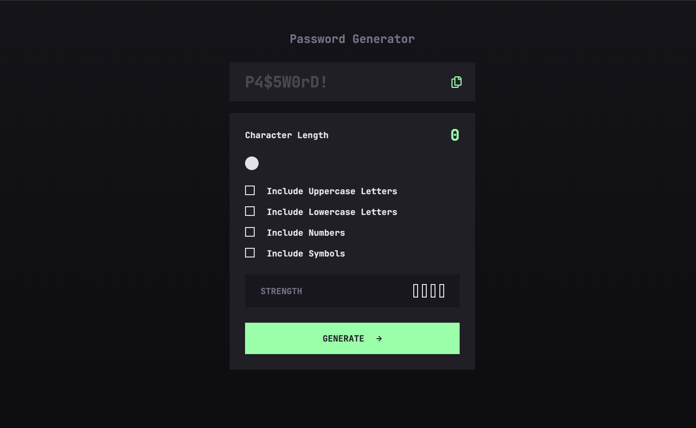

# Frontend Mentor - Password generator app solution

This is a solution to the [Password generator app challenge on Frontend Mentor](https://www.frontendmentor.io/challenges/password-generator-app-Mr8CLycqjh). Frontend Mentor challenges help you improve your coding skills by building realistic projects.

## Table of contents

- [Overview](#overview)
  - [The challenge](#the-challenge)
  - [Screenshot](#screenshot)
  - [Links](#links)
- [My process](#my-process)
  - [Built with](#built-with)
  - [What I learned](#what-i-learned)
  - [Continued development](#continued-development)
  - [Useful resources](#useful-resources)
- [Author](#author)

## Overview

### The challenge

Users should be able to:

- Generate a password based on the selected inclusion options
- Copy the generated password to the computer's clipboard
- See a strength rating for their generated password
- View the optimal layout for the interface depending on their device's screen size
- See hover and focus states for all interactive elements on the page

### Screenshot

### Links

- Solution URL: [Here](https://www.frontendmentor.io/solutions/vanilla-js-and-sass-aIAPVKkyBD)
- Live Site URL: [Here](https://nv-password-generator-app.netlify.app/)

## My process

### Built with

- Semantic HTML5 markup
- SASS/SCSS
- Flexbox
- Mobile-first workflow

### What I learned

This challenge presented a couple new aspects that I have not used frequently. The first being copying text to the clipboard and the second was custom styling for range inputs.

### Continued development

I look forward to continue these challenges that provide opportunities to try new and different scripting and styling methods that will further advance my frontend coding skills.

### Useful resources

- [Creating A Custom Range Input That Looks Consistent Across All Browsers](https://www.smashingmagazine.com/2021/12/create-custom-range-input-consistent-browsers/) - This was a helpful tutorial on creating custom range inputs
- [Creating a custom CSS range slider with JavaScript upgrades](https://blog.logrocket.com/creating-custom-css-range-slider-javascript-upgrades/) - This is another great tutorial on creating custom range inputs
- [How To Customize Checkboxes With CSS](https://blog.openreplay.com/how-to-customize-checkboxes-with-css/) - This is a good tutorial on creating custom styled checkboxes

## Author

- Portfolio - [Nate Valline](https://natevalline.dev)
- Frontend Mentor - [@nvalline](https://www.frontendmentor.io/profile/nvalline)
- LinkedIn - [Nate Valline](https://www.linkedin.com/in/nvalline)
